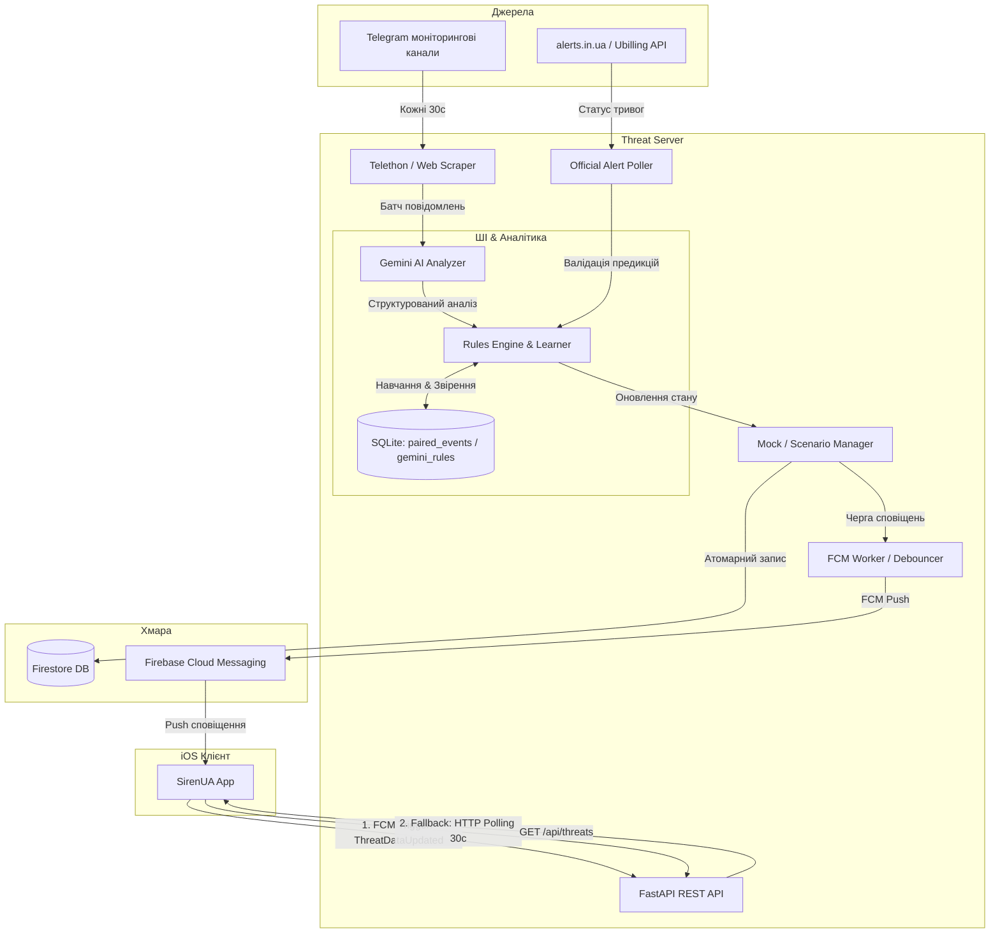
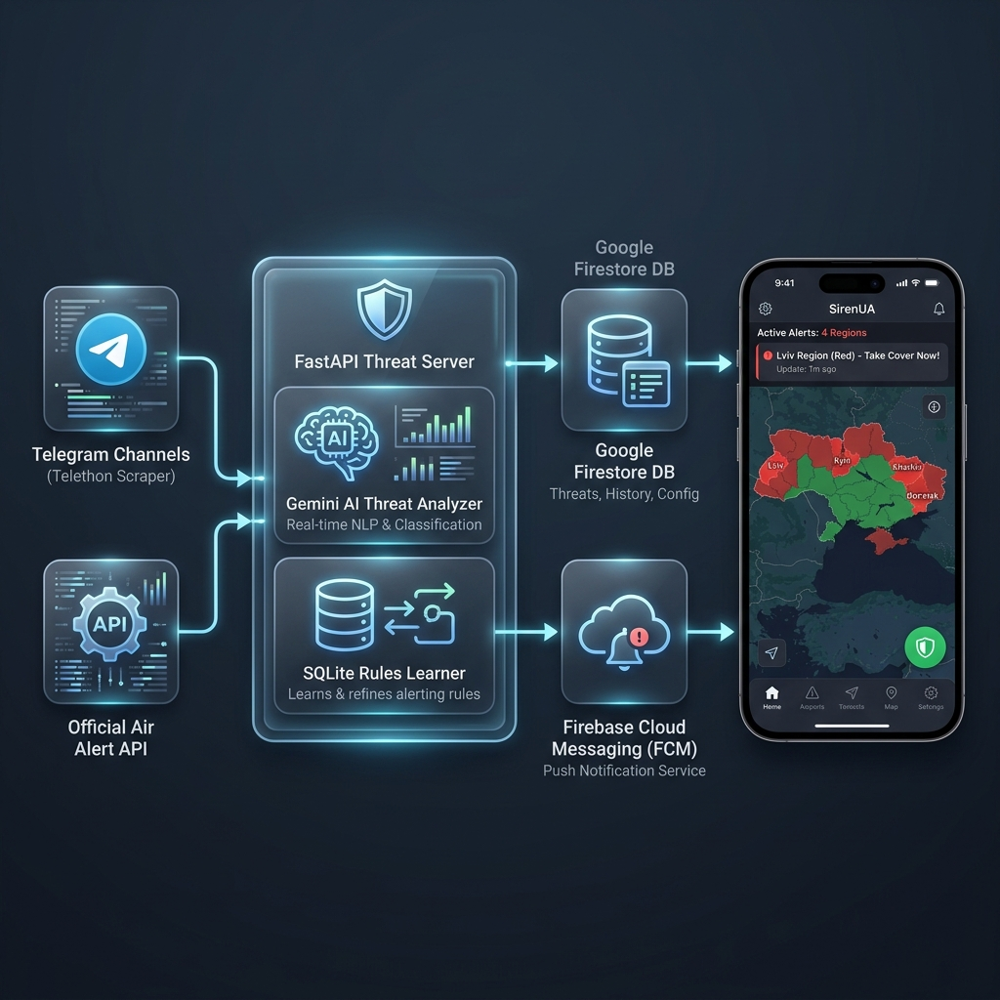

# SirenUA Threat Monitor Server

> **Ціль системи:** SirenUA — це система раннього попередження про повітряні загрози для цивільного населення України.

Програмний комплекс складається з FastAPI-сервера, модуля ШІ-аналізу (Gemini AI), бази даних для навчання правил (SQLite/Firestore) та системи мобільних сповіщень. Сервер обробляє повідомлення з моніторингових Telegram-каналів за допомогою Gemini LLM, прогнозує вектори руху повітряних цілей, оцінює рівень загрози по областях та сповіщає користувачів через Firebase Cloud Messaging (FCM).

---

## 🏗️ Схема архітектури та потоку даних





---

## 🛠️ Як працює система

### 1. Збір даних (Scraping & Polling)

- **Моніторинг Telegram**: Scraper зчитує повідомлення з офіційних каналів кожні 30 секунд.
- **Офіційні тривоги**: Poller перевіряє статус тривог в Україні через API `alerts.in.ua` (з автоматичним fallback на `ubilling.net.ua`).

### 2. ШІ-Аналізатор (Gemini AI Analyzer)

- Зібрані повідомлення обробляються через Gemini Pro за допомогою спеціально оптимізованого системного промпту (написаного англійською для точності логіки, але з виводом виключно українською мовою).
- Для кожного повідомлення Gemini визначає:
  - `threat_level` (`none`, `low`, `medium`, `high`, `critical`)
  - `threat_type` (`shahed`, `mig31k`, `cruise_missile`, `kab`, `ballistic`, `tu95` (стратегічна авіація), `iskander` (балістичні комплекси), `artillery` (артобстріл/РСЗВ))
  - `detail` (опис загрози, відстань, швидкість, напрямок)
  - `confidence` (відсоток впевненості)
  - `eta` (очікуваний час прибуття цілі)
  - `is_predictive` (чи є загроза предиктивною/випереджувальною)
  - `target_cities_coords` (динамічно визначені ШІ координати населених пунктів, якщо їх немає у статичній базі)
- **Динамічне визначення координат та ETA**:
  - Якщо згаданий населений пункт відсутній у вбудованому словнику `CITY_COORDINATES`, бекенд використовує координати, які Gemini оцінив та повернув у `target_cities_coords`.
  - На основі цих координат обчислюється відстань до цілі, і в залежності від швидкості польоту для даного типу загрози (наприклад, 150-180 км/год для Shahed, 800 км/год для Tu-95, 4500-7000 км/год для балістики) розраховується точний час прибуття (ETA).
- **Резервний регулярний аналізатор (Regex Fallback)**:
  - У випадку перевищення квот чи збою API Gemini, автоматично спрацьовує вбудований регулярний парсер `_detect_threat_type` у `telegram_monitor.py`. Він містить вичерпний набір регулярних виразів для класифікації загрози, визначення типу та призначення швидкостей і тайм-аутів очищення.
- **Фільтрація флуду**: Повідомлення про наслідки, аналітику чи загальні заяви автоматично маркуються рівнем `none` і відсікаються на рівні промпту.

### 3. Навчання правил (Rules Engine & Rules Learner)

- **Співставлення подій (`paired_events`)**: Система записує в локальну базу даних SQLite кожен прогноз ШІ та зіставляє його з офіційним настанням повітряної тривоги.
- **Rules Learner**: Фоновий процес кожні 6 годин аналізує успішні прогнози, будує маршрути повітряних цілей та створює динамічні правила (`gemini_rules`).
- **Згасання правил (Decay)**: Правила, що застаріли (понад 14 днів) або мають точність менше 50%, автоматично деактивуються.

### 4. Оптимізація запитів та FCM Debouncing

- **Батчева обробка**: Замість запису в Firestore при кожній зміні, сервер під час масової атаки працює в `_batch_mode`. Усі записи історії об'єднуються в один транзакційний Firestore Batch (`flush_history_batch()`).
- **Групування FCM**: Повідомлення про загрози накопичуються під час батчу. Метод `flush_fcm_batch()` відправляє сповіщення для всіх областей одночасно, але активує **звуковий сигнал лише для першого пушу**, захищаючи телефон користувача від звукового спаму при масованих атаках (10+ областей одночасно).

### 5. FCM Push-driven клієнт (iOS)

- **Відмова від WebSockets**: Постійні WebSocket-з'єднання були повністю видалені для заощадження заряду батареї пристрою та стабільності на слабкому мобільному інтернеті.
- **Push-driven оновлення**:
  1. Коли сервер виявляє нову загрозу, він надсилає FCM Push.
  2. Додаток (`AppDelegate`) ловить пуш і через `NotificationCenter` сповіщає `AlertViewModelV3`.
  3. Додаток робить миттєвий HTTP-запит `GET /api/threats` для отримання свіжої карти загроз.
  4. Як резервний канал працює стандартне HTTP-опитування кожні 30 секунд.

### 6. Авто-бекап та захист від забруднення правил (Firestore Backup & Test Protection)

Для збереження цілісності бази даних SQLite (де зберігаються `paired_events` та вивчені правила `gemini_rules`) та захисту її від впливу тестування, реалізовано наступні механізми:

- **Авто-бекап перед тестами**: Щоразу, коли ініціюється тестовий сценарій (`POST /api/threats/scenario`) або вручну встановлюється перша тестова загроза (`POST /api/threats/mock`), сервер автоматично створює та завантажує стиснутий бекап SQLite в Firestore.
- **Очищення та відновлення**: При виклику очищення тестів (ендпоінт `POST /api/threats/clear` з параметром `only_test=True`), сервер повністю очищає тестові записи з таблиці `paired_events` (щоб вони не спотворювали аналітику самонавчання Gemini) та відновлює оригінальний "чистий" стан бази даних з Firestore.
- **Бекап при зупинці (Graceful Shutdown)**: Під час перезапуску сервера або перебудови контейнера на Render, життєвий цикл FastAPI (`lifespan shutdown`) автоматично робить фінальний бекап бази у Firestore.
- **Автовідновлення при старті**: При запуску контейнера (`lifespan startup`) сервер автоматично завантажує та розпаковує останній бекап з Firestore, зберігаючи історію тривог та вивчені правила.

---

## 🚀 API ендпоінти

- `GET /` — Статус сервісу, режим роботи (live/mock) та стан підключення до Telegram.
- `GET /api/threats` — Поточний стан загроз та офіційних тривог по всіх областях України.
- `GET /api/gemini/status` — Діагностика статусу роботи API Gemini.
- `GET /api/analytics/heatmap` — Дані історичної активності загроз по областях за останні N днів.
- `GET /api/analytics/rules` — Список активних вивчених ШІ правил.
- `POST /api/threats/mock` — Вручну встановити загрозу для тестування (лише в Mock-режимі).
- `POST /api/threats/scenario` — Запуск симуляційних сценаріїв (зліт МіГ-31К, атака Шахедів, крилаті ракети тощо).

---

## 🛠️ Локальний запуск

1. Встановіть залежності:

   ```bash
   pip install -r requirements.txt
   ```

2. Налаштуйте файл оточення `.env` у корені проєкту.
3. Запуск сервера:
   - В Mock-режимі (для тестів): `python server.py`
   - В Live-режимі (з моніторингом): `python server.py --live` (або `LIVE_MODE=true`)

---

## 📊 Адмін-панель та Аналітична Хронологія

У системі SirenUA розмежовано два рівні логування та відображення хронології повітряних загроз для різних типів користувачів:

### 1. Користувацька хронологія (Premium Timeline)
* **Джерело даних**: Firebase Firestore (колекція `sirenua_history`).
* **Опис**: Простий лінійний лог поодиноких подій. Користувач бачить окремо картку про виявлення загрози (наприклад, `🚨 Шахед`) та окремо картку про відбій (наприклад, `🟢 Відбій загрози`). Ця стрічка призначена виключно для інформування цивільного населення.
* **Синхронізація часу**: Зберігається в UTC. При запитах за конкретну дату (`/api/history/{region}?date=YYYY-MM-DD`), сервер перетворює локальний київський час доби в UTC діапазон і виконує швидке порівняння стрічок. Додаток iOS автоматично конвертує отримані UTC мітки у локальний час телефону.

### 2. Адмінська аналітична хронологія (Admin Feedback Loop)
* **Джерело даних**: Локальна SQLite база даних сервера (`paired_events`, `threat_history`, `threat_clearings`).
* **Опис**: Просунутий життєвий цикл тривог. Початок тривоги та її відбій об'єднуються бекендом в один зв'язаний запис (**Paired Event**). Це дозволяє розраховувати тривалість загрози у секундах, а також фіксувати точність роботи ШІ.
* **Синхронізація часу**: У SQLite дані записуються в UTC за допомогою `CURRENT_TIMESTAMP`. Для коректного групування в адмін-ендпоінтах (наприклад, агрегація по годинах чи днях), сервер динамічно вираховує поточний зсув часу для часової зони `Europe/Kiev` (наприклад, `+3 hours` влітку) та зміщує UTC мітки перед `GROUP BY` в SQLite. Клієнтська адмін-панель (SwiftUI) конвертує UTC мітки індивідуальних записів у локальний часовий пояс пристрою.
* **Звіти про завершення (Resolution Type)**: При відбої тривоги Gemini аналізує повідомлення і записує тип завершення:
  * `intercepted` (🛡️ **Збито**) — успішно знищено силами ППО.
  * `impact` (💥 **Влучання**) — зафіксовано приліт або пошкодження.
  * `unknown` — ціль зникла або вийшла з простору без додаткових даних.
  Ці статуси відображаються кольоровими бейджами безпосередньо у стрічці подій адмін-панелі в iOS додатку.

### 🧠 Зворотний зв'язок та Навчання ШІ (Feedback Loop)
Статуси точності тривог (`confirmed` або `overestimated`), отримані під час закриття подій у другому випадку, використовуються фоновим сервісом **Rules Learner** для щоденного навчання системи:
1. **Користування правилами**: Вивчені правила (наприклад, зв'язки між регіонами `route_pattern` або часові патерни атак `time_pattern`) автоматично додаються в контекст Gemini при кожному новому аналізі повідомлень.
2. **Корекція впевненості (Confidence Correction)**: Якщо для певної області ШІ часто дає хибні тривоги (надто високий показник `overestimated` за 30 днів), створюється правило автоматичного зниження рівня впевненості (наприклад, `-15%`). Це оберігає користувачів від звукового спаму та хибних тривог.

