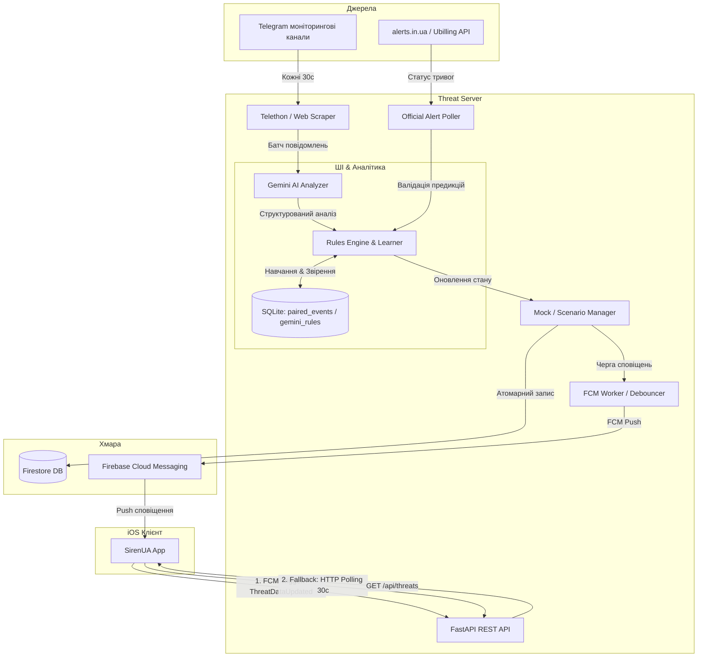

# SirenUA Threat Monitor Server

> **Ціль системи:** SirenUA — це система раннього попередження про повітряні загрози для цивільного населення України.

Програмний комплекс складається з FastAPI-сервера, модуля ШІ-аналізу (Gemini AI), бази даних для навчання правил (SQLite/Firestore) та системи мобільних сповіщень. Сервер обробляє повідомлення з моніторингових Telegram-каналів за допомогою Gemini LLM, прогнозує вектори руху повітряних цілей, оцінює рівень загрози по областях та сповіщає користувачів через Firebase Cloud Messaging (FCM).

---

## 🏗️ Схема архітектури та потоку даних



---

## 🛠️ Як працює система

### 1. Збір даних (Scraping & Polling)

- **Моніторинг Telegram**: Scraper зчитує повідомлення з офіційних каналів кожні 30 секунд.
- **Офіційні тривоги**: Poller перевіряє статус тривог в Україні через API `alerts.in.ua` (з автоматичним fallback на `ubilling.net.ua`).

### 2. ШІ-Аналізатор (Gemini AI Analyzer)

- Зібрані повідомлення обробляються через Gemini Pro за допомогою спеціально оптимізованого системного промпту (написаного англійською для точності логіки, але з виводом виключно українською мовою).
- Для кожного повідомлення Gemini визначає:
  - `threat_level` (`none`, `low`, `medium`, `high`, `critical`)
  - `threat_type` (`shahed`, `mig31k`, `cruise_missile`, `kab`, `ballistic`)
  - `detail` (опис загрози, відстань, швидкість, напрямок)
  - `confidence` (відсоток впевненості)
  - `eta` (очікуваний час прибуття цілі)
  - `is_predictive` (чи є загроза предиктивною/випереджувальною)
- **Фільтрація флуду**: Повідомлення про наслідки, аналітику чи загальні заяви автоматично маркуються рівнем `none` і відсікаються на рівні промпту.

### 3. Навчання правил (Rules Engine & Rules Learner)

- **Співставлення подій (`paired_events`)**: Система записує в локальну базу даних SQLite кожен прогноз ШІ та зіставляє його з офіційним настанням повітряної тривоги.
- **Rules Learner**: Фоновий процес кожні 6 годин аналізує успішні прогнози, будує маршрути повітряних цілей та створює динамічні правила (`gemini_rules`).
- **Згасання правил (Decay)**: Правила, що застаріли (понад 14 днів) або мають точність менше 50%, автоматично деактивуються.

### 4. Оптимізація запитів та FCM Debouncing

- **Батчева обробка**: Замість запису в Firestore при кожній зміні, сервер під час масової атаки працює в `_batch_mode`. Усі записи історії об'єднуються в один транзакційний Firestore Batch (`flush_history_batch()`).
- **Групування FCM**: Повідомлення про загрози накопичуються під час батчу. Метод `flush_fcm_batch()` відправляє сповіщення для всіх областей одночасно, але активує **звуковий сигнал лише для першого пушу**, захищаючи телефон користувача від звукового спаму при масованих атаках (10+ областей одночасно).

### 5. FCM Push-driven клієнт (iOS)

- **Відмова від WebSockets**: Постійні WebSocket-з'єднання були повністю видалені для заощадження заряду батареї пристрою та стабільності на слабкому мобільному інтернеті.
- **Push-driven оновлення**:
  1. Коли сервер виявляє нову загрозу, він надсилає FCM Push.
  2. Додаток (`AppDelegate`) ловить пуш і через `NotificationCenter` сповіщає `AlertViewModelV3`.
  3. Додаток робить миттєвий HTTP-запит `GET /api/threats` для отримання свіжої карти загроз.
  4. Як резервний канал працює стандартне HTTP-опитування кожні 30 секунд.

---

## 🚀 API ендпоінти

- `GET /` — Статус сервісу, режим роботи (live/mock) та стан підключення до Telegram.
- `GET /api/threats` — Поточний стан загроз та офіційних тривог по всіх областях України.
- `GET /api/gemini/status` — Діагностика статусу роботи API Gemini.
- `GET /api/analytics/heatmap` — Дані історичної активності загроз по областях за останні N днів.
- `GET /api/analytics/rules` — Список активних вивчених ШІ правил.
- `POST /api/threats/mock` — Вручну встановити загрозу для тестування (лише в Mock-режимі).
- `POST /api/threats/scenario` — Запуск симуляційних сценаріїв (зліт МіГ-31К, атака Шахедів, крилаті ракети тощо).

---

## 🛠️ Локальний запуск

1. Встановіть залежності:

   ```bash
   pip install -r requirements.txt
   ```

2. Налаштуйте файл оточення `.env` у корені проєкту.
3. Запуск сервера:
   - В Mock-режимі (для тестів): `python server.py`
   - В Live-режимі (з моніторингом): `python server.py --live` (або `LIVE_MODE=true`)
