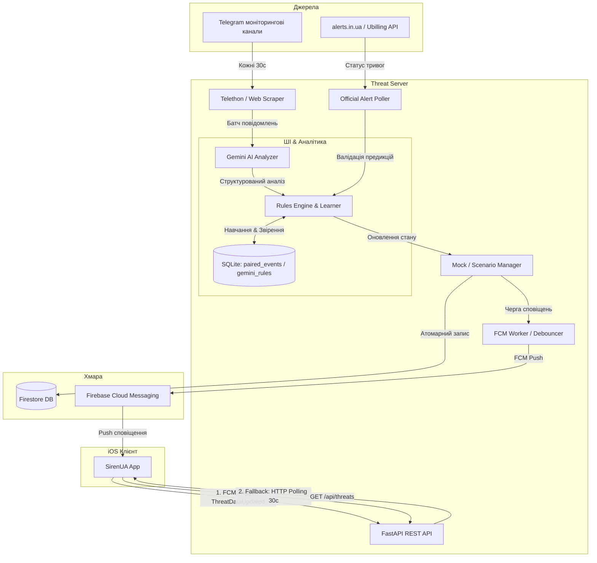
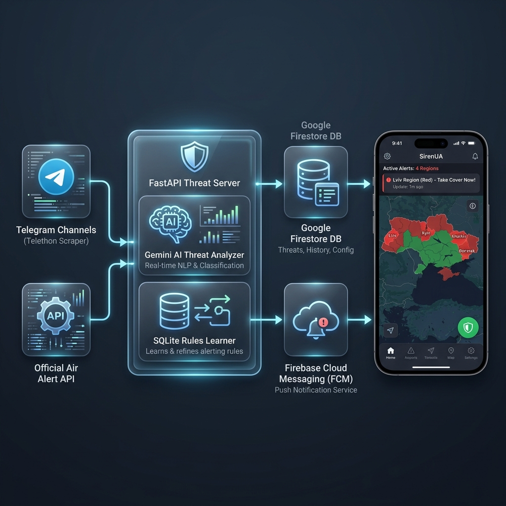

# SirenUA Threat Monitor Server

> **Ціль системи:** SirenUA — це система раннього попередження про повітряні загрози для цивільного населення України.

Програмний комплекс складається з FastAPI-сервера, модуля ШІ-аналізу (Gemini AI), бази даних для навчання правил (SQLite/Firestore) та системи мобільних сповіщень. Сервер обробляє повідомлення з моніторингових Telegram-каналів за допомогою Gemini LLM, прогнозує вектори руху повітряних цілей, оцінює рівень загрози по областях та сповіщає користувачів через Firebase Cloud Messaging (FCM).

---

## 🏗️ Схема архітектури та потоку даних


```mermaid
graph TD
    %% Джерела даних
    subgraph Джерела
        TG[Telegram моніторингові канали]
        OfficialAPI[alerts.in.ua / Ubilling API]
    end

    %% Сервер обробки
    subgraph Threat Server
        Scraper[Telethon / Web Scraper]
        Poller[Official Alert Poller]
        
        subgraph ШІ & Аналітика
            Gemini[Gemini AI Analyzer]
            Rules[Rules Engine & Learner]
            DB[(SQLite: paired_events / gemini_rules)]
        end
        
        Manager[Mock / Scenario Manager]
        FCMWorker[FCM Worker / Debouncer]
        FastAPI[FastAPI REST API]
    end

    %% Хмара та Клієнт
    subgraph Хмара
        Firestore[(Firestore DB)]
        FCM[Firebase Cloud Messaging]
    end

    subgraph iOS Клієнт
        App[SirenUA App]
    end

    %% Зв'язки
    TG -->|Кожні 30с| Scraper
    Scraper -->|Батч повідомлень| Gemini
    Gemini -->|Структурований аналіз| Rules
    Rules <-->|Навчання & Звірення| DB
    OfficialAPI -->|Статус тривог| Poller
    Poller -->|Валідація предикцій| Rules
    
    Rules -->|Оновлення стану| Manager
    Manager -->|Атомарний запис| Firestore
    Manager -->|Черга сповіщень| FCMWorker
    
    FCMWorker -->|FCM Push| FCM
    FCM -->|Push сповіщення| App
    
    App -->|1. FCM Trigger: ThreatDataUpdated| FastAPI
    App -->|2. Fallback: HTTP Polling 30с| FastAPI
    FastAPI -->|GET /api/threats| App
```



---

## 🛠️ Як працює система

### 1. Збір даних (Scraping & Polling)

- **Моніторинг Telegram**: Scraper зчитує повідомлення з офіційних каналів кожні 30 секунд.
- **Офіційні тривоги**: Poller перевіряє статус тривог в Україні через API `alerts.in.ua` (з автоматичним fallback на `ubilling.net.ua`).

### 2. ШІ-Аналізатор (Gemini AI Analyzer)

- Зібрані повідомлення обробляються через Gemini Pro за допомогою спеціально оптимізованого системного промпту (написаного англійською для точності логіки, але з виводом виключно українською мовою).
- Для кожного повідомлення Gemini визначає:
  - `threat_level` (`none`, `low`, `medium`, `high`, `critical`)
  - `threat_type` (16 канонічних типів: `shahed`, `cruise_missile`, `ballistic`, `mig31k`, `kab`, `tu95`, `tu22m3`, `su35_su57`, `iskander`, `artillery`, `zircon`, `mlrs`, `fpv`, `recon_uav`, `official_alarm`, `unknown`)
  - `detail` (опис загрози, відстань, швидкість, напрямок)
  - `confidence` (відсоток впевненості)
  - `eta` (очікуваний час прибуття цілі)
  - `is_predictive` (чи є загроза предиктивною/випереджувальною)
  - `target_cities_coords` (динамічно визначені ШІ координати населених пунктів, якщо їх немає у статичній базі)
- **Динамічне визначення координат та ETA**:
  - Якщо згаданий населений пункт відсутній у вбудованому словнику `CITY_COORDINATES`, бекенд використовує координати, які Gemini оцінив та повернув у `target_cities_coords`.
  - На основі цих координат обчислюється відстань до цілі, і в залежності від швидкості польоту для даного типу загрози (наприклад, 165 км/год для Shahed, 850 км/год для крилатих ракет, 900 км/год для КАБ, 2500 км/год для МіГ-31К, 5500 км/год для балістики/Іскандера, 11000 км/год для Циркона) розраховується точний час прибуття (ETA).
- **Резервний регулярний аналізатор (Regex Fallback)**:
  - У випадку перевищення квот чи збою API Gemini, автоматично спрацьовує вбудований регулярний парсер `detect_threat_type_from_text` у `core/threat_types.py`. Він містить вичерпний набір регулярних виразів для класифікації загрози, визначення типу та призначення швидкостей і тайм-аутів очищення.
- **Фільтрація флуду**: Повідомлення про наслідки, аналітику чи загальні заяви автоматично маркуються рівнем `none` і відсікаються на рівні промпту.

### 3. Навчання правил (Rules Engine & Rules Learner)

- **Співставлення подій (`paired_events`)**: Система записує в локальну базу даних SQLite кожен прогноз ШІ та зіставляє його з офіційним настанням повітряної тривоги.
- **Rules Learner**: Фоновий процес кожні 6 годин аналізує успішні прогнози, будує маршрути повітряних цілей та створює динамічні правила (`gemini_rules`).
- **Згасання правил (Decay)**: Правила, що застаріли (понад 14 днів) або мають точність менше 50%, автоматично деактивуються.

### 4. Оптимізація запитів та FCM Debouncing

- **Батчева обробка**: Замість запису в Firestore при кожній зміні, сервер під час масової атаки працює в `_batch_mode`. Усі записи історії об'єднуються в один транзакційний Firestore Batch (`flush_history_batch()`).
- **Групування FCM**: Повідомлення про загрози накопичуються під час батчу. Метод `flush_fcm_batch()` відправляє сповіщення для всіх областей одночасно, але активує **звуковий сигнал лише для першого пушу**, захищаючи телефон користувача від звукового спаму при масованих атаках (10+ областей одночасно).

### 5. FCM Push-driven клієнт (iOS)

- **Відмова від WebSockets**: Постійні WebSocket-з'єднання були повністю видалені для заощадження заряду батареї пристрою та стабільності на слабкому мобільному інтернеті.
- **Push-driven оновлення**:
  1. Коли сервер виявляє нову загрозу, він надсилає FCM Push.
  2. Додаток (`AppDelegate`) ловить пуш і через `NotificationCenter` сповіщає `AlertViewModelV3`.
  3. Додаток робить миттєвий HTTP-запит `GET /api/threats` для отримання свіжої карти загроз.
  4. Як резервний канал працює стандартне HTTP-опитування кожні 30 секунд.

### 6. Авто-бекап та захист від забруднення правил (Firestore Backup & Test Protection)

Для збереження цілісності бази даних SQLite (де зберігаються `paired_events` та вивчені правила `gemini_rules`) та захисту її від впливу тестування, реалізовано наступні механізми:

- **Авто-бекап перед тестами**: Щоразу, коли ініціюється тестовий сценарій (`POST /api/threats/scenario`) або вручну встановлюється перша тестова загроза (`POST /api/threats/mock`), сервер автоматично створює та завантажує стиснутий бекап SQLite в Firestore.
- **Очищення та відновлення**: При виклику очищення тестів (ендпоінт `POST /api/threats/clear` з параметром `only_test=True`), сервер повністю очищає тестові записи з таблиці `paired_events` (щоб вони не спотворювали аналітику самонавчання Gemini) та відновлює оригінальний "чистий" стан бази даних з Firestore.
- **Бекап при зупинці (Graceful Shutdown)**: Під час перезапуску сервера або перебудови контейнера на Render, життєвий цикл FastAPI (`lifespan shutdown`) автоматично робить фінальний бекап бази у Firestore.
- **Автовідновлення при старті**: При запуску контейнера (`lifespan startup`) сервер автоматично завантажує та розпаковує останній бекап з Firestore, зберігаючи історію тривог та вивчені правила.

### 7. 4-Рівнева глобальна система логування та аудиту (Global Logging)

Для забезпечення 100% прозорості функціонування сервера впроваджено 4-рівневу систему збору та аудиту даних:

1. **Рівень 1 (Live Streaming)**: Middleware логування кожного HTTP-запиту (IP, метод, шлях, статус, тривалість), стрім подій Telegram-скрейпера, інжекції правил Gemini та відправки FCM пушів.
2. **Рівень 2 (Реляційне сховище `threat_analytics.db`)**: 9 спеціалізованих таблиць (`threat_history`, `telemetry_data`, `threat_clearings`, `paired_events`, `gemini_rules`, `gemini_rules_audit`, `error_log`, `palantir_reports`, `analytics_reports`).
3. **Рівень 3 (Хмарне дзеркалювання в Firestore)**: Реальний стрім історії у `sirenua_threats_history` та 15-хвилинні атомарні GZIP бекапи у `sirenua_database_backup/sqlite_tables`.
4. **Рівень 4 (Діагностичні API)**: Адміністративні інтерфейси для моніторингу помилок, правил та геопросторових кореляцій.

---

## 🚀 API ендпоінти

### Загальні та моніторингові

- `GET /` або `/health` — Статус сервісу, режим роботи (live/mock) та стан підключення до Telegram.
- `GET /api/threats` — Поточний стан загроз та офіційних тривог по всіх областях України (з розрахунком ETA та векторів).
- `GET /api/gemini/status` — Діагностика статусу роботи API Gemini, активних ключів та моделі.
- `POST /api/telegram/test` — Миттєвий тестовий прогін повідомлення через Gemini AI.

### Адміністративні та аналітичні (Admin Console)

- `GET /api/admin/dashboard/stats` — Загальна статистика точності, кількість активних загроз та сумарна аналітика за 7 днів.
- `GET /api/admin/chronology/v2` — Повна хронологія зшитих парних сесій (Paired Events) життєвого циклу тривог.
- `GET /api/admin/palantir/overview` — Комплексний зріз розвідки Palantir (хаби запуску, матриця ризиків для 26 областей).
- `GET /api/admin/palantir/chains` — Багатокрокові ланцюжки польотів Маркова (Markov Chains) та ймовірності на вузлових роздоріжжях.
- `GET /api/admin/palantir/attrition` — Матриця виснаження цілей та оцінка щільності ППО по областях.
- `GET /api/admin/errors/stats` та `GET /api/admin/errors/recent` — Моніторинг та фільтрація системних помилок (`gemini`, `telegram`, `fcm`, `server`).
- `GET /api/analytics/rules` та `GET /api/admin/rules/history` — Перелік активних емпіричних правил та історія їх навчання.
- `GET /api/analytics/heatmap` — Дані історичної активності загроз по областях за останні N днів.

### Самонавчання та автономні процеси (AI Feedback Loop)

- `POST /api/admin/rules/post_mortem?hours=4` — Запуск поглибленої рефлексії після атак (Post-Mortem reflection) та синтезу нових правил.
- `POST /api/analytics/predictions/learn` — Фоновий 6-годинний статистичний аналізатор завершених сесій та калібрувальник ETA.
- `POST /api/admin/seed_history` — Генерація синтетичної демо-історії для тестування аналітики.

### Тестування та симуляції

- `POST /api/threats/mock` — Вручну встановити кастомну загрозу (з підтримкою телеметрії: швидкість, курс, вектор, впевненість).
- `POST /api/threats/scenario` — Запуск комплексних симуляційних сценаріїв (`mig_takeoff`, `shaheds_south`, `cruise_missiles_west`, `massive_attack`, `ballistic_kharkiv`, `clear`).

---

## 🛠️ Локальний запуск та Ngrok тунель

1. Встановіть залежності:

   ```bash
   pip install -r requirements.txt
   ```

2. Налаштуйте файл оточення `.env` у корені проєкту (включаючи `GEMINI_API_KEYS`).
3. Запуск сервера:
   - В Mock-режимі (для тестів): `python server.py`
   - В Live-режимі (з моніторингом): `python server.py --live` (або `LIVE_MODE=true`)

4. **Проксівання через Ngrok (для iOS-клієнта)**:
   Для забезпечення захищеного HTTPS-з'єднання з iOS-пристроями та симулятором без залежності від хмарного сервісу Render, локальний сервер проксується через **ngrok**:
   ```bash
   ngrok http 8085
   ```
   Отриману публічну HTTPS-адресу (наприклад, `https://e7d9-185-94-219-55.ngrok-free.app`) необхідно вказувати у `NetworkManager.serverURL` iOS-додатка.

---

## 📊 Адмін-панель та Аналітична Хронологія

У системі SirenUA розмежовано два рівні логування та відображення хронології повітряних загроз для різних типів користувачів:

### 1. Користувацька хронологія (Premium Timeline)
* **Джерело даних**: Firebase Firestore (колекція `sirenua_history`).
* **Опис**: Простий лінійний лог поодиноких подій. Користувач бачить окремо картку про виявлення загрози (наприклад, `🚨 Шахед`) та окремо картку про відбій (наприклад, `🟢 Відбій загрози`). Ця стрічка призначена виключно для інформування цивільного населення.
* **Синхронізація часу**: Зберігається в UTC. При запитах за конкретну дату (`/api/history/{region}?date=YYYY-MM-DD`), сервер перетворює локальний київський час доби в UTC діапазон і виконує швидке порівняння стрічок. Додаток iOS автоматично конвертує отримані UTC мітки у локальний час телефону.

### 2. Адмінська аналітична хронологія (Admin Feedback Loop)
* **Джерело даних**: Локальна SQLite база даних сервера (`paired_events`, `threat_history`, `threat_clearings`).
* **Опис**: Просунутий життєвий цикл тривог. Початок тривоги та її відбій об'єднуються бекендом в один зв'язаний запис (**Paired Event**). Це дозволяє розраховувати тривалість загрози у секундах, а також фіксувати точність роботи ШІ.
* **Синхронізація часу**: У SQLite дані записуються в UTC за допомогою `CURRENT_TIMESTAMP`. Для коректного групування в адмін-ендпоінтах (наприклад, агрегація по годинах чи днях), сервер динамічно вираховує поточний зсув часу для часової зони `Europe/Kiev` (наприклад, `+3 hours` влітку) та зміщує UTC мітки перед `GROUP BY` в SQLite. Клієнтська адмін-панель (SwiftUI) конвертує UTC мітки індивідуальних записів у локальний часовий пояс пристрою.
* **Звіти про завершення (Resolution Type)**: При відбої тривоги Gemini аналізує повідомлення і записує тип завершення:
  * `intercepted` (🛡️ **Збито**) — успішно знищено силами ППО.
  * `impact` (💥 **Влучання**) — зафіксовано приліт або пошкодження.
  * `unknown` — ціль зникла або вийшла з простору без додаткових даних.
  Ці статуси відображаються кольоровими бейджами безпосередньо у стрічці подій адмін-панелі в iOS додатку.

### 🧠 Зворотний зв'язок та Навчання ШІ (Feedback Loop & Autonomous Rules Learner)

Система самонавчання правил безпеки розділена на два чітких рівні: **Миттєве використання (Inference)** та **Періодична модифікація (Learning)**.

#### 1. Миттєве використання правил (Inference Time)
При кожному вхідному повідомленні з Telegram функція `GeminiThreatAnalyzer.build_rules_context()` зчитує всі активні правила з бази `gemini_rules` (`is_active = 1`, `accuracy >= 60%`, `evidence >= 3`) та вставляє їх у системний промпт моделі. Gemini аналізує повідомлення з урахуванням цих правил та повертає поле `rules_applied`, показуючи, які саме патерни було застосовано.

#### 2. Періодична модифікація та оновлення бази правил (Learning Cycle)
Фоновий процес **`GeminiRulesLearner`** прокидається **кожні 6 годин** (або за ручним запитом `/api/analytics/predictions/learn`) і аналізує завершені сесії `paired_events` за останні 30 днів за **5 суворими математичними критеріями**:

1. **🗺️ Маршрутні патерни (`route_pattern`)**:
   - **Критерій**: не менше 5 переходів загрози з області А в область Б за 30 днів (`occurrence_count >= 5`).
   - **Результат**: створення або оновлення правила зв'язку (наприклад: *«Загрози Shahed з Сумської області мають 88% шанс досягти Полтавської області (підтверджено 12 разів)»*).
   - **Аудит**: запис події `added` або `updated` у таблицю `gemini_rules_audit`.

2. **⚖️ Коригування впевненості (`confidence_correction`)**:
   - **Критерій**: накопичення не менше 7 завершених сесій по області (`total >= 7`).
   - **Результат**: якщо ШІ часто переоцінював загрозу (`overestimated`), створюється правило автоматичного зниження рівня довіри (наприклад, `-15%`), щоб уникнути помилкових тривог.

3. **⏰ Часові патерни атак (`time_pattern`)**:
   - **Критерій**: не менше 7 ударів у певну годину доби (`total >= 7`) по групі цілей.
   - **Результат**: правило прогнозування нічних/ранкових масованих нальотів.

4. **⏱️ Математика часу підльоту (`eta_math`)**:
   - **Критерій**: не менше 3 підтверджених польотів за вектором з точністю >= 55% (`occurrence_count >= 3`).
   - **Результат**: калібрування середнього та граничного часу дольоту (наприклад: *«Математика дольоту Shahed з Київської до Рівненської області: ~75-90 хв»*).

5. **📉 Згасання та очищення застарілих правил (`apply_rule_decay`)**:
   - **Критерій**: точність правила впала нижче 50% (`accuracy_score < 0.50`) або воно не оновлювалося понад 14 днів.
   - **Результат**: деактивація правила (`is_active = 0`) та запис події `deactivated` в `gemini_rules_audit`.

#### 3. Автономна ШІ-Рефлексія після атак (Gemini Post-Mortem Reflection Engine)
Модуль `analyzer/rules/post_mortem.py` забезпечує глибинний розбір бойових сесій одразу після завершення нальотів (`threat_manager.clear_all()` або відбій хвиль):
- **Аналіз сесії**: порівнює початкові прогнози ШІ, хронологію польоту та реальні результати відбоїв (`intercepted`, `impact`, `out_of_airspace`, `overestimated`).
- **Самоаналіз та синтез правил**: Gemini формулює нові правила тактики ворога (наприклад: *«Шахеди з Полтавщини вздовж русла річки заходять на Черкащину (Канів)»*) та записує їх у базу знань `gemini_rules` з аудитом в `gemini_rules_audit`.
- **Ручний виклик**: `POST /api/admin/rules/post_mortem?hours=4`.

#### 4. Динамічний контекстний фільтр правил (Dynamic Rules RAG)
Для скорочення часу відповіді Gemini до субсекундного рівня (<0.8с) без перевантаження промпту зайвими токенами, функція `GeminiThreatAnalyzer.build_rules_context(messages_text)` здійснює семантичну фільтрацію:
- Визначає активні географічні кластери (Північний, Східний, Південний, Центральний, Західний, Стратегічна авіація).
- Відбирає лише 6–8 найбільш релевантних правил із найвищим рангом `(accuracy_score * evidence_count)`.

---

---

## 👁️ Тактична Розвідка Palantir Tactical Intelligence Engine v2.5

Система Palantir об'єднує геопросторову телеметрію та формує оперативну розвідувальну картину для 26 областей:
- **Багатокрокові ланцюжки польотів (`/api/admin/palantir/chains`)**: розрахунок 3+ хопових траєкторій Маркова (наприклад, *Сумщина ➔ Полтавщина ➔ Черкащина*) та ймовірностей розгалуження на вузлових роздоріжжях.
- **Виснаження цілей силами ППО (`/api/admin/palantir/attrition`)**: обчислення відсотка перехоплення мобільними вогневими групами за кожним регіоном.
- **Хаби запуску ворога (`launch_hubs`)**: моніторинг активності аеродромів і полігонів пуску (Саваслейка, Приморсько-Ахтарськ, Курськ, Чорне море).
- **Матриця ризиків (`region_risk_matrix`)**: інтегральна оцінка загрози для всіх регіонів.

---

## 🛡️ База Укриттів Цивільного Захисту та Геопросторовий Двигун (`ShelterManager`)

Модуль `database/shelter_manager.py` забезпечує миттєвий просторовий пошук найближчих укриттів:

1. **Вбудований pre-seed реєстр (`shelters_seed.json`)**:
   - Автоматично завантажується при ініціалізації (`is_loaded = True` без затримок холодного старту).
   - Містить перевірені об'єкти цивільного захисту (навчальні заклади, дитсадки, амбулаторії, старостати, лікарні з ПРУ, підземні сховища) для сіл, райцентрів (наприклад, с. Угерсько, с. Добряни, м. Стрий) та обласних центрів.
2. **Просторовий сітковий індекс (`_GridIndex`)**:
   - Розбиває територію на комірки `0.05°` (~5.5 км) з динамічним урахуванням широти для України.
   - Пошук за радіусом за формулою Haversine із сортуванням за найкоротшою відстанню.
3. **Динамічний live-запит Overpass (`_fetch_targeted_osm_shelters`)**:
   - При відсутності локальних точок у пам'яті сервер асинхронно виконує швидкий цільовий запит радіусом 10–15 км до Overpass API.
   - Нові об'єкти автоматично вбудовуються в просторовий індекс на льоту.
4. **Ендпоінти API**:
   - `GET /api/shelters?lat={lat}&lon={lon}&radius={m}&limit={n}` — пошук найближчих укриттів із живим fallback.
   - `POST /api/shelters/upload_json` — пакетне завантаження офіційних реєстрів.

---

